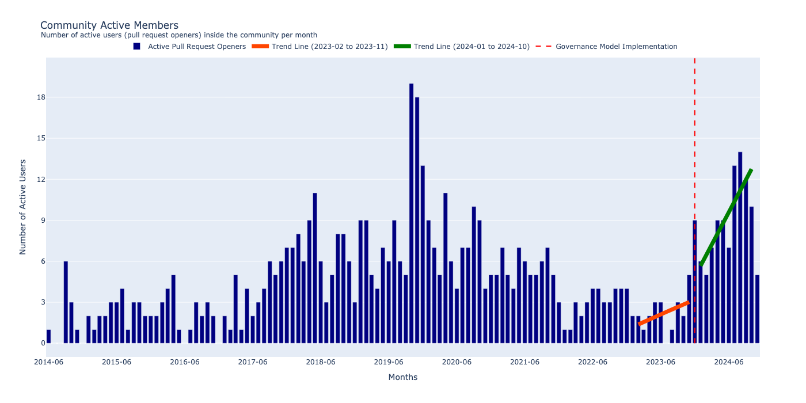
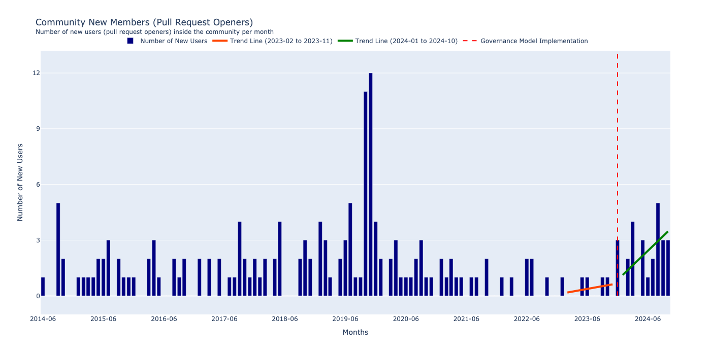
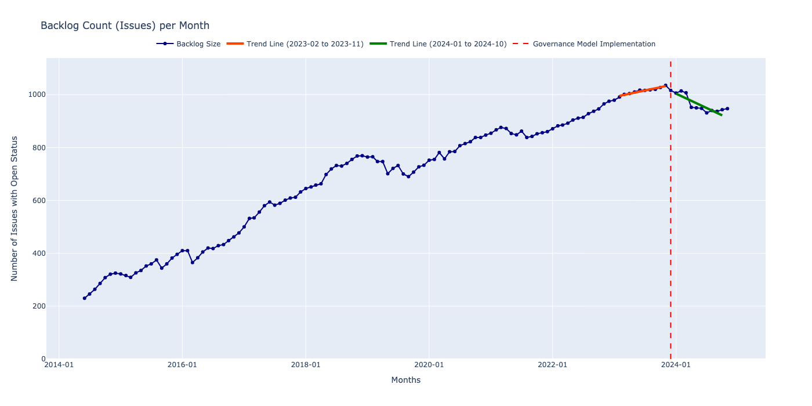

# DataLab-Research-Project

## Age Distribution
#### Issue Mean Age 
This graph illustrates the age distribution of issues within the project. It provides insights into how long issues remain open, highlighting any potential backlog or inefficiencies in issue resolution.

#### Pull Requests Mean Age
This plot represents the age of pull requests, showing how quickly pull requests are reviewed and merged. A skewed distribution could indicate bottlenecks in the development workflow.

## Conclusion Rate
#### Opened and Closed Pull Requests Rate
The chart tracks the number of pull requests opened and closed over time. This data helps in understanding the project's activity level and whether the community is maintaining a steady pace in closing pull requests.

#### Pedrominant Community Activity
This visualization identifies the main type of activity that members engage in, such as submitting pull requests, or reviewing pull requests. This can show where the community focuses its efforts.

## Active Members in Community
#### Community Active Members (All Activities)
A breakdown of the number of active contributors involved in various activities over a given time period. This helps to gauge overall community participation.

#### Community Active Members (Pull Request Openers)
This graph zeroes in on the subset of active members who specifically open pull requests. It's useful for tracking the developer involvement in code contributions.

#### Community Active Proportion PR Focused Members
The proportion of active members focused on pull requests compared to other activities. It highlights whether most community activity is driven by code contributions.

## New Members in Community
#### Community New Members by Month (All Activities)
A month-by-month analysis of new members joining the community, giving an indication of growth trends and the influx of new contributors.

#### Community New Members by Month (Pull Request Openers)
This chart shows the number of new members specifically contributing by opening pull requests. It's a measure of how appealing the project is to new developers.

#### Community Retained Members by Month (Pull Request Openers)
This chart measures the number of contributors who opened pull requests and continued to participate in subsequent months. It provides insights into member retention and sustained involvement, which are important indicators of a healthy community.

## Reviewers in Community
#### Active Reviewers in Community
This graph displays the number of active reviewers in the community over time, reflecting the community's code review strength and collaborative culture.

## Backlog Analysis
#### Issues Backlog Size
A visualization of the total number of unresolved issues over time. It serves as a metric for assessing the project's capacity to manage incoming and existing issues.

#### Pull Request Backlog Size
This plot tracks the number of pull requests awaiting review or merging, indicating how well the project handles code contributions and potential bottlenecks.

## Pull Request Activity Analysis
#### Pull Requests Created per User by Month
This chart tracks how many pull requests each user has submitted per month. It helps identify patterns in individual contributor activity, highlighting the most active developers and periods of increased participation.

#### Pull Request Revisions per User by Month
This plot shows the number of revisions made by each user per month on their pull requests. It reflects the extent of ongoing changes and updates to proposed code, providing insight into how contributions evolve before being merged or closed.
